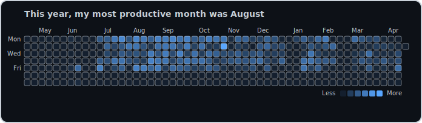
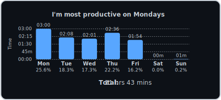
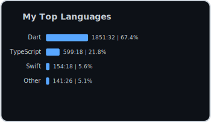

## Hi! Welcome 😀

**Coding Stats:**  

<!-- WakaTime: Heatmap on top, then Weekly Avg + All Langs side-by-side -->
<table>
  <tr>
    <td colspan="2" align="center">
      
    </td>
  </tr>
  <tr>
    <td align="center">
      
    </td>
    <td align="center">
      
    </td>
  </tr>
</table>

**Contributions:**  

**Holopin Badges:**  

**Junior Cybersecurity Analyst Career Path Badge:**  

 

